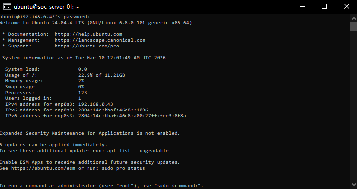
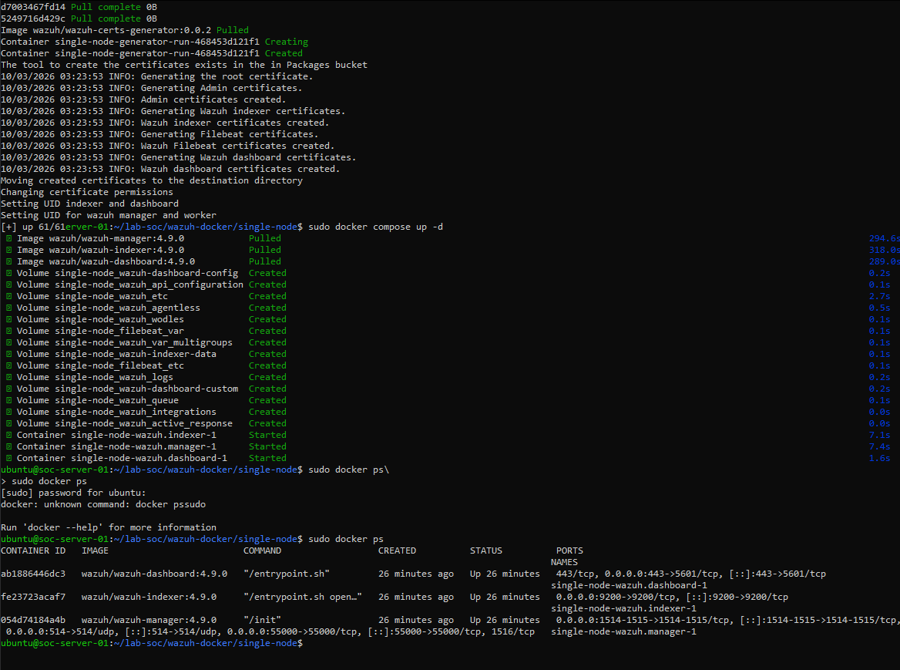
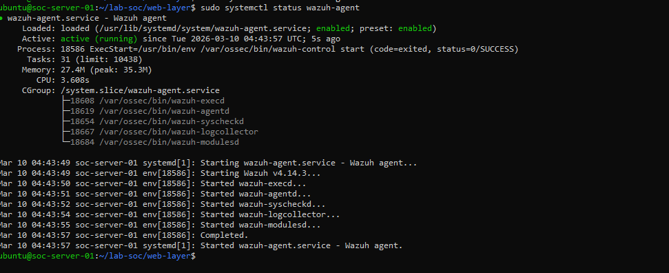
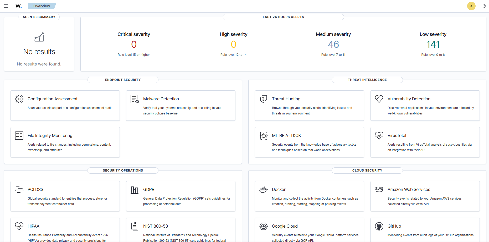
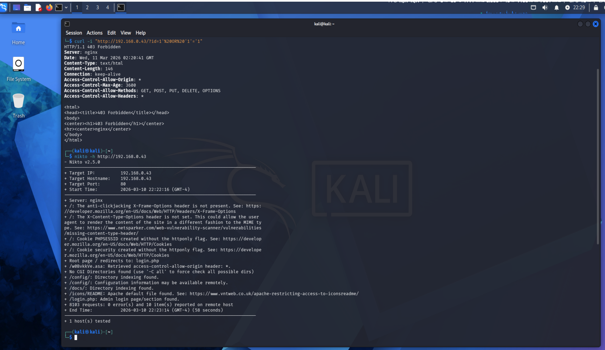
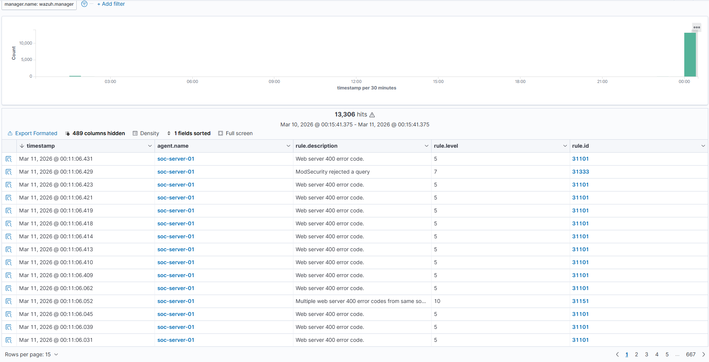
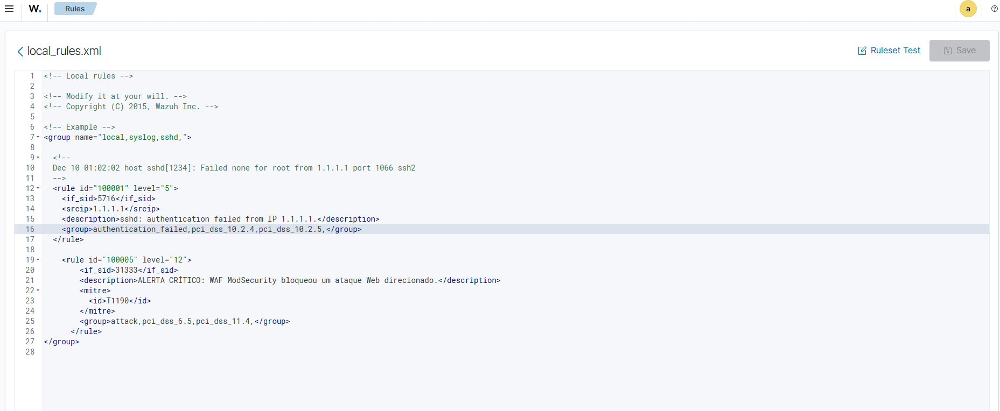
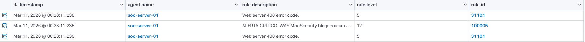

# 🛡️ SOC Home Lab & Detection Engineering

**A hands-on lab demonstrating the complete lifecycle of a cybersecurity operation: Infrastructure Provisioning (Docker/LVM), Perimeter Defense (ModSecurity WAF), Attack Simulation (Kali Linux), and Detection Engineering (Wazuh SIEM).**

## 🎯 Project Objective
To demonstrate in practice the complete flow of a cyberattack — from initial reconnaissance to mitigation and detection — covering the disciplines of Infrastructure Engineering, Red Team operations, and Blue Team response.

## 🛠️ Technology Stack
- **Operating System**: Ubuntu Server 24.04 LTS
- **Virtualization & Orchestration**: VirtualBox, Docker e Docker Compose
- **Attack Target (Vulnerable Application)**: Damn Vulnerable Web App (DVWA)
- **Perimeter Defense (WAF)**: Nginx + ModSecurity (OWASP Core Rule Set)
- **SIEM / XDR**: Wazuh (Manager, Indexer, Dashboard e Agent)
- **Attacker Machine**: Kali Linux (Tools: Nikto, cURL)

---

## 🚀 Stage 1: Infrastructure & Provisioning

The lab's foundation was built on an Ubuntu server running all services inside Docker containers to ensure isolation and straightforward lifecycle management.

**Base server provisioning:**

During the provisioning of the SIEM's resource-heavy stack, I encountered a classic infrastructure incident response scenario: disk exhaustion. To resolve the outage, I operated directly on the Linux filesystem — physically expanding the disk and performing a live LVM partition resize (lvextend and resize2fs) with zero data loss.

**Bringing up the full SOC stack with Docker Compose:**

---

## 🛡️ Stage 2: The Defense (WAF & SIEM)

With the infrastructure healthy, the DVWA application was placed behind a Nginx Reverse Proxy equipped with ModSecurity running in Enforcement Mode. All malicious traffic would be blocked and fully audited at the edge.

A Wazuh Agent was deployed on the web server to collect those audit logs and stream them in real time to the Manager.

**Wazuh Agent active and colecting data:**

**General SIEM Panel:**

---

## ⚔️ Stage 3: Attack Simulation (Red Team)

Using a Kali Linux virtual machine, I initiated external attack simulations to validate both WAF resilience and SIEM visibility.

The following attacks were executed:
- **Manual SQL Injection attacks: Using curl to inject malicious payloads directly into URL parameters.
- **Vulnerability Scanning:**: Running Nikto to generate a high volume of aggressive requests and stress-test the detection engine.

The WAF performed as expected, blocking every malicious request and returning HTTP 403 Forbidden to the attacker.

**Attacker's perspective:**

---

## 🕵️‍♂️ Stage 4: Detection Engineering & Tuning (Blue Team)

This is where the lab delivered its greatest practical value. Analyzing the SOC dashboard, I observed over 13,000 logs ingested during the scanner attack.

However, I identified a critical flaw in risk classification — a Severity False Negative. Wazuh was receiving the SQL Injection blocks from ModSecurity but categorizing each event as only Level 7 (Medium Risk) under a generic web server rule.

**SOC receiving the mass attack, but classifying it as medium severity:**

In a real-world environment, a targeted attack blocked at the edge demands critical visibility. To remediate this, I authored a Custom Rule Override directly in the Wazuh rules engine.

The new rule was designed to:

1. Intercept the original ModSecurity log event ID.
2. Escalate severity to Level 12 (Critical).
3. Attach a precise, human-readable incident description.
4. Map the detection to MITRE ATT&CK tactic T1190 — Exploit Public-Facing Application.

**Tuning session**

---

## 🎯 Final Result

After tuning and restarting the Manager, a new surgical attack was launched. The full architecture validated the expected flow: the WAF blocked the injection, the Agent routed the log upstream, and the SIEM — now properly trained — fired a critical red alert in real time, ensuring no SOC analyst would ever lose this event in the daily noise.

**Successful detection — Critical Alert (Level 12) firing in real time:**

---

## 💡 Conclusion & Lessons Learned

This lab demonstrated that deploying security tooling — WAFs, SIEMs, agents — is only the first step of a mature defense strategy. The most critical work of a Blue Team lies in deeply understanding log behavior, continuously troubleshooting the infrastructure pipeline (such as log routing through Docker networks and LVM storage management), and above all, tuning detection rules to transform raw, noisy data into actionable security intelligence.
